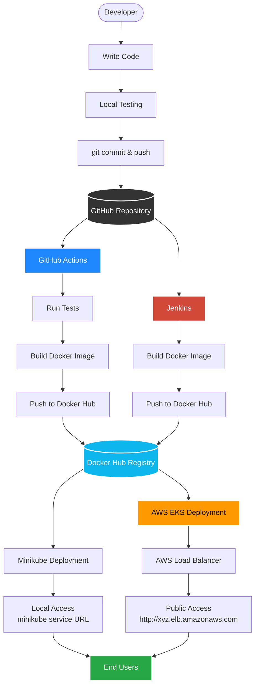
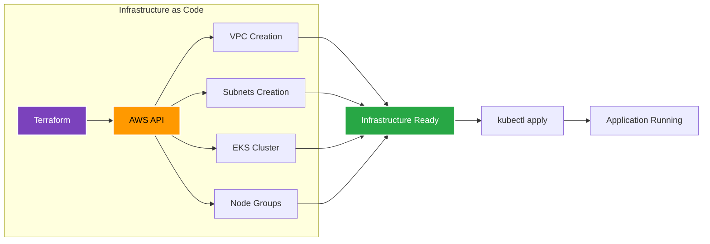

# Hello World DevOps Project

A complete end-to-end DevOps project demonstrating CI/CD pipelines, containerization, and Kubernetes deployment on both local and cloud environments.


---

## 📋 Table of Contents

- [Overview](#overview)
- [Architecture](#architecture)
- [Visual Project Flow](#visual-project-flow)
- [Technologies Used](#technologies-used)
- [Project Structure](#project-structure)
- [Prerequisites](#prerequisites)
- [Local Development](#local-development)
- [Docker Setup](#docker-setup)
- [CI/CD Pipelines](#cicd-pipelines)
- [Kubernetes Deployment](#kubernetes-deployment)
  - [Minikube (Local)](#minikube-local)
  - [AWS EKS (Production)](#aws-eks-production)
- [Infrastructure as Code](#infrastructure-as-code)
- [Monitoring and Health Checks](#monitoring-and-health-checks)
- [Troubleshooting](#troubleshooting)
- [Cost Considerations](#cost-considerations)
- [Contributing](#contributing)
- [License](#license)

---

## 🎯 Overview

This project demonstrates a complete DevOps workflow from development to production deployment. It showcases:

- **Microservices Development**: Simple Flask-based REST API
- **Containerization**: Multi-stage Docker builds for optimized images
- **CI/CD**: Automated testing, building, and deployment using GitHub Actions and Jenkins
- **Container Orchestration**: Kubernetes deployment on Minikube and AWS EKS
- **Infrastructure as Code**: Terraform for AWS infrastructure provisioning
- **Cloud Native Practices**: Health checks, auto-scaling, load balancing

---

## 🏗️ Architecture

### High-Level Architecture

```
┌─────────────┐
│  Developer  │
└──────┬──────┘
       │ git push
       ▼
┌─────────────────┐
│     GitHub      │
└────────┬────────┘
         │ webhook
         ▼
┌──────────────────────┐
│   CI/CD Pipeline     │
│  (GitHub Actions /   │
│      Jenkins)        │
└──────────┬───────────┘
           │
           ├─► Build Docker Image
           ├─► Run Tests
           └─► Push to Docker Hub
                      │
                      ▼
            ┌──────────────────┐
            │   Docker Hub     │
            └─────────┬────────┘
                      │
         ┌────────────┴────────────┐
         │                         │
         ▼                         ▼
┌─────────────────┐     ┌──────────────────┐
│    Minikube     │     │     AWS EKS      │
│  (Development)  │     │   (Production)   │
└─────────────────┘     └──────────────────┘
         │                         │
         └────────┬────────────────┘
                  ▼
           ┌──────────────┐
           │     Users    │
           └──────────────┘
```

### AWS EKS Architecture

```
┌───────────────────────────────────────────────────────────┐
│                         AWS Cloud                         │
│                                                           │
│  ┌─────────────────────────────────────────────────────┐ │
│  │                    VPC (10.0.0.0/16)                │ │
│  │                                                     │ │
│  │  ┌──────────────────┐  ┌──────────────────┐       │ │
│  │  │  Public Subnet   │  │  Public Subnet   │       │ │
│  │  │  (10.0.101.0/24) │  │  (10.0.102.0/24) │       │ │
│  │  │                  │  │                  │       │ │
│  │  │  ┌────────────┐  │  │  ┌────────────┐  │       │ │
│  │  │  │    ALB     │  │  │  │ NAT Gateway│  │       │ │
│  │  │  └────────────┘  │  │  └────────────┘  │       │ │
│  │  └──────────────────┘  └──────────────────┘       │ │
│  │           │                      │                 │ │
│  │           │                      │                 │ │
│  │  ┌──────────────────┐  ┌──────────────────┐       │ │
│  │  │ Private Subnet   │  │ Private Subnet   │       │ │
│  │  │  (10.0.1.0/24)   │  │  (10.0.2.0/24)   │       │ │
│  │  │                  │  │                  │       │ │
│  │  │  ┌──────────┐    │  │  ┌──────────┐    │       │ │
│  │  │  │ EKS Node │    │  │  │ EKS Node │    │       │ │
│  │  │  │   Pod 1  │    │  │  │   Pod 2  │    │       │ │
│  │  │  │   Pod 2  │    │  │  │   Pod 3  │    │       │ │
│  │  │  └──────────┘    │  │  └──────────┘    │       │ │
│  │  └──────────────────┘  └──────────────────┘       │ │
│  │                                                     │ │
│  └─────────────────────────────────────────────────────┘ │
│                                                           │
└───────────────────────────────────────────────────────────┘
                          │
                          ▼
                   ┌──────────────┐
                   │ Docker Hub   │
                   └──────────────┘
```

---

## 🎨 Visual Project Flow

### Complete DevOps Pipeline



### Infrastructure as Code Flow



### Detailed Flow Diagram

```
┌─────────────────────────────────────────────────────────────────────────────┐
│                            DEVELOPMENT PHASE                                │
└─────────────────────────────────────────────────────────────────────────────┘

    Developer writes code
           │
           ├── app.py (Flask application)
           ├── Dockerfile (Container definition)
           ├── requirements.txt (Dependencies)
           └── k8s/ (Kubernetes manifests)
           │
           ▼
    Local Testing
           │
           ├── python app.py (Run locally)
           ├── docker build (Test containerization)
           └── minikube (Test K8s deployment)
           │
           ▼
    git commit -m "Feature implementation"
           │
           ▼
    git push origin main


┌─────────────────────────────────────────────────────────────────────────────┐
│                          VERSION CONTROL (GITHUB)                           │
└─────────────────────────────────────────────────────────────────────────────┘

           ▼
    ┌──────────────┐
    │    GitHub    │
    │  Repository  │
    └──────┬───────┘
           │
           ├─────────────────────────────┐
           │                             │
           ▼                             ▼


┌──────────────────────────────┐    ┌──────────────────────────────┐
│      GITHUB ACTIONS          │    │         JENKINS              │
│      (Cloud CI/CD)           │    │    (Self-hosted CI/CD)       │
└──────────────────────────────┘    └──────────────────────────────┘
           │                                     │
           │ 1. Checkout code                    │ 1. Checkout code
           │ 2. Setup Python                     │ 2. Build Docker image
           │ 3. Install dependencies             │ 3. Push to registry
           │ 4. Run tests                        │
           │ 5. Build Docker image               │
           │ 6. Push to Docker Hub               │
           │                                     │
           └─────────────┬───────────────────────┘
                         │
                         ▼


┌─────────────────────────────────────────────────────────────────────────────┐
│                           CONTAINER REGISTRY                                │
└─────────────────────────────────────────────────────────────────────────────┘

                    ┌──────────────┐
                    │  Docker Hub  │
                    │              │
                    │  Image Tags: │
                    │  - latest    │
                    │  - sha-abc   │
                    └──────┬───────┘
                           │
           ┌───────────────┴───────────────┐
           │                               │
           ▼                               ▼


┌──────────────────────────────┐    ┌──────────────────────────────┐
│      LOCAL DEPLOYMENT        │    │     CLOUD DEPLOYMENT         │
│         (MINIKUBE)           │    │        (AWS EKS)             │
└──────────────────────────────┘    └──────────────────────────────┘
           │                                     │
           │                                     │
           ▼                                     ▼

    kubectl apply -f k8s/              kubectl apply -f k8s/
           │                                     │
           ▼                                     ▼

┌─────────────────────────┐         ┌──────────────────────────────┐
│   Minikube Cluster      │         │     AWS EKS Cluster          │
│                         │         │                              │
│   ┌───────────────┐     │         │  ┌────────────────────────┐  │
│   │  Master Node  │     │         │  │   Control Plane        │  │
│   └───────────────┘     │         │  │   (AWS Managed)        │  │
│          │              │         │  └────────────────────────┘  │
│   ┌──────┴──────┐       │         │             │                │
│   │             │       │         │    ┌────────┴────────┐       │
│   ▼             ▼       │         │    │                 │       │
│ ┌──────┐    ┌──────┐   │         │    ▼                 ▼       │
│ │ Pod1 │    │ Pod2 │   │         │  ┌──────┐         ┌──────┐   │
│ └──────┘    └──────┘   │         │  │Node1 │         │Node2 │   │
│      ↓           ↓      │         │  │      │         │      │   │
│   NodePort:30000       │         │  │┌────┐│         │┌────┐│   │
│                         │         │  ││Pod1││         ││Pod2││   │
└────────┬────────────────┘         │  │└────┘│         │└────┘│   │
         │                          │  │┌────┐│         │┌────┐│   │
         ▼                          │  ││Pod3││         ││Pod4││   │
                                    │  │└────┘│         │└────┘│   │
minikube service URL                │  └──────┘         └──────┘   │
http://192.168.49.2:30000          │         │                     │
                                    │         ▼                     │
                                    │  ┌────────────────┐          │
                                    │  │ Load Balancer  │          │
                                    │  │  (AWS ALB/NLB) │          │
                                    │  └────────┬───────┘          │
                                    └───────────┼──────────────────┘
                                                │
                                                ▼
                                     http://xyz.elb.amazonaws.com


┌─────────────────────────────────────────────────────────────────────────────┐
│                              END USERS                                      │
└─────────────────────────────────────────────────────────────────────────────┘

                    ┌──────────────────────┐
                    │   Web Browser/App    │
                    │                      │
                    │  Accesses:           │
                    │  - Development: via  │
                    │    Minikube URL      │
                    │  - Production: via   │
                    │    AWS Load Balancer │
                    └──────────────────────┘
```

### Monitoring & Health Check Flow

```
┌─────────────────────────────────────────────────────────────────────────────┐
│                       MONITORING & HEALTH CHECKS                            │
└─────────────────────────────────────────────────────────────────────────────┘

    Kubernetes Probes
           │
           ├────────────────────┬────────────────────┐
           ▼                    ▼                    ▼
    ┌──────────────┐    ┌──────────────┐    ┌──────────────┐
    │   Liveness   │    │  Readiness   │    │     Logs     │
    │    Probe     │    │    Probe     │    │              │
    │              │    │              │    │  kubectl     │
    │ GET /health  │    │ GET /health  │    │   logs       │
    │ Every 10s    │    │ Every 5s     │    │              │
    │              │    │              │    │              │
    │ If fails 3x: │    │ If fails:    │    │ View in:     │
    │ RESTART POD  │    │ Remove from  │    │ - Console    │
    │              │    │   Service    │    │ - CloudWatch │
    └──────────────┘    └──────────────┘    └──────────────┘
           │                    │                    │
           └────────────────────┴────────────────────┘
                                │
                                ▼
                        ┌───────────────┐
                        │  Healthy Pods │
                        │  Serving      │
                        │  Traffic      │
                        └───────────────┘
```

---

## 🛠️ Technologies Used

### Application

- **Python 3.11** - Programming language
- **Flask** - Web framework
- **Gunicorn** - WSGI HTTP Server (production)

### Containerization

- **Docker** - Container platform
- **Docker Compose** - Multi-container orchestration (development)

### CI/CD

- **GitHub Actions** - Cloud-based CI/CD
- **Jenkins** - Self-hosted CI/CD

### Orchestration

- **Kubernetes** - Container orchestration
- **Minikube** - Local Kubernetes cluster
- **Amazon EKS** - Managed Kubernetes service

### Infrastructure as Code

- **Terraform** - Infrastructure provisioning
- **AWS** - Cloud provider

### Container Registry

- **Docker Hub** - Container image registry

---

## 📁 Project Structure

```
project-1/
│
├── .github/
│   └── workflows/
│       └── ci-cd.yml              # GitHub Actions workflow
│
├── k8s/
│   ├── deployment.yaml            # Kubernetes Deployment manifest
│   └── service.yaml               # Kubernetes Service manifest
│
├── terraform/
│   ├── main.tf                    # Main Terraform configuration
│   ├── variables.tf               # Terraform variables
│   ├── outputs.tf                 # Terraform outputs
│   └── .gitignore                 # Terraform-specific ignores
│
├── app.py                         # Flask application
├── requirements.txt               # Python dependencies
├── Dockerfile                     # Docker image definition
├── .dockerignore                  # Docker build excludes
├── .gitignore                     # Git ignores
├── Jenkinsfile                    # Jenkins pipeline definition
└── README.md                      # This file
```

---

## ✅ Prerequisites

### For Local Development

- Python 3.11+
- pip (Python package manager)

### For Docker

- Docker Desktop (Windows/Mac) or Docker Engine (Linux)

### For Kubernetes

- kubectl (Kubernetes CLI)
- Minikube (for local deployment)

### For AWS EKS

- AWS CLI
- Terraform
- AWS Account with appropriate permissions

### For CI/CD

- GitHub account
- Docker Hub account
- Jenkins (if using Jenkins pipeline)

---

## 🚀 Local Development

### 1. Clone the Repository

```bash
git clone https://github.com/Naser-ali-g/project-1.git
cd project-1
```

### 2. Create Virtual Environment

```bash
# Create virtual environment
python -m venv venv

# Activate virtual environment
# Windows:
venv\Scripts\activate
# Linux/Mac:
source venv/bin/activate
```

### 3. Install Dependencies

```bash
pip install -r requirements.txt
```

### 4. Run the Application

```bash
python app.py
```

### 5. Test the Application

```bash
# Open browser and navigate to:
http://localhost:5000

# Or use curl:
curl http://localhost:5000

# Health check endpoint:
curl http://localhost:5000/health
```

**Expected Responses:**

- `/` → `Hello World from DevOps Pipeline!`
- `/health` → `{"status": "healthy"}`

---

## 🐳 Docker Setup

### Build Docker Image

```bash
# Build image
docker build -t hello-world-flask:latest .

# List images
docker images
```

### Run Docker Container

```bash
# Run container
docker run -d -p 5000:5000 --name hello-world-app hello-world-flask:latest

# Check running containers
docker ps

# View logs
docker logs hello-world-app

# Stop container
docker stop hello-world-app

# Remove container
docker rm hello-world-app
```

### Push to Docker Hub

```bash
# Login to Docker Hub
docker login

# Tag image
docker tag hello-world-flask:latest YOUR_USERNAME/hello-world-flask:latest

# Push image
docker push YOUR_USERNAME/hello-world-flask:latest
```

---

## 🔄 CI/CD Pipelines

This project includes two CI/CD implementations:

### 1. GitHub Actions (Cloud-based)

**Workflow File:** `.github/workflows/ci-cd.yml`

**Triggers:**

- Push to `main` branch
- Pull requests to `main` branch

**Pipeline Stages:**

1. **Checkout** - Clone repository
2. **Setup Python** - Install Python 3.11
3. **Install Dependencies** - Install required packages
4. **Run Tests** - Execute test suite
5. **Setup Docker Buildx** - Prepare Docker builder
6. **Login to Docker Hub** - Authenticate with registry
7. **Build and Push** - Build image and push to Docker Hub

**Setup:**

1. Go to GitHub repository settings
2. Navigate to: Settings → Secrets and variables → Actions
3. Add secrets:
   - `DOCKER_USERNAME` - Your Docker Hub username
   - `DOCKER_PASSWORD` - Your Docker Hub access token

**Skip CI:**
Add `[skip ci]` to commit message:

```bash
git commit -m "Update documentation [skip ci]"
```

**View Pipeline:**

- Go to repository → Actions tab
- Click on workflow run to see details

---

### 2. Jenkins (Self-hosted)

**Pipeline File:** `Jenkinsfile`

**Setup:**

1. **Install Jenkins:**

```bash
   # Windows (using Chocolatey)
   choco install jenkins

   # Or download from: https://www.jenkins.io/download/
```

2. **Install Required Plugins:**

   - Docker Pipeline
   - Git plugin
   - Pipeline plugin

3. **Configure Docker Hub Credentials:**

   - Go to: Manage Jenkins → Manage Credentials
   - Add credentials:
     - Kind: Username with password
     - ID: `dockerhub-credentials`
     - Username: Your Docker Hub username
     - Password: Your Docker Hub access token

4. **Create Pipeline Job:**
   - Click "New Item"
   - Enter name: `hello-world-flask-pipeline`
   - Select "Pipeline"
   - Under Pipeline section:
     - Definition: "Pipeline script from SCM"
     - SCM: Git
     - Repository URL: `https://github.com/Naser-ali-g/project-1.git`
     - Branch: `*/main`
     - Script Path: `Jenkinsfile`

**Pipeline Stages:**

1. **Checkout** - Clone repository from GitHub
2. **Build** - Build Docker image
3. **Push** - Push image to Docker Hub

**Run Pipeline:**

- Manually: Click "Build Now" in Jenkins UI
- Automatically: Configure webhook in GitHub (Settings → Webhooks)

**Access Jenkins:**

```
http://localhost:8080
```

---

### CI/CD Comparison

| Feature              | GitHub Actions              | Jenkins                      |
| -------------------- | --------------------------- | ---------------------------- |
| **Hosting**          | Cloud (GitHub)              | Self-hosted                  |
| **Setup Complexity** | Easy                        | Moderate                     |
| **Cost**             | Free for public repos       | Free (hosting cost only)     |
| **Maintenance**      | None                        | Self-managed                 |
| **Integration**      | Native GitHub               | Requires webhook             |
| **Best For**         | Quick setup, cloud projects | Custom workflows, enterprise |

---

## ☸️ Kubernetes Deployment

### Minikube (Local)

#### 1. Start Minikube

```bash
# Start Minikube cluster
minikube start --driver=docker --memory=4096 --cpus=2

# Verify cluster
minikube status
kubectl cluster-info
```

#### 2. Deploy Application

```bash
# Apply Kubernetes manifests
kubectl apply -f k8s/

# Check deployment
kubectl get deployments
kubectl get pods
kubectl get services
```

#### 3. Access Application

```bash
# Get service URL
minikube service hello-world-flask-service --url

# Or use port forwarding
kubectl port-forward service/hello-world-flask-service 5000:5000

# Access at http://localhost:5000
```

#### 4. Useful Commands

```bash
# Scale deployment
kubectl scale deployment hello-world-flask --replicas=5

# View logs
kubectl logs -l app=hello-world-flask

# Restart deployment
kubectl rollout restart deployment hello-world-flask

# Delete resources
kubectl delete -f k8s/
```

---

### AWS EKS (Production)

#### 1. Prerequisites

```bash
# Install AWS CLI
# Windows: choco install awscli
# Mac: brew install awscli
# Linux: apt-get install awscli

# Install Terraform
# Windows: choco install terraform
# Mac: brew install terraform
# Linux: apt-get install terraform

# Configure AWS credentials
aws configure
```

#### 2. Provision Infrastructure with Terraform

```bash
# Navigate to terraform directory
cd terraform/

# Initialize Terraform
terraform init

# Preview changes
terraform plan

# Create infrastructure (takes 15-20 minutes)
terraform apply

# Save outputs
terraform output > outputs.txt
```

**Resources Created:**

- VPC with public and private subnets
- Internet Gateway and NAT Gateway
- EKS Cluster (Kubernetes control plane)
- EKS Node Group (2x t3.small EC2 instances)
- Security Groups and IAM Roles
- Load Balancer (created by Kubernetes Service)

#### 3. Configure kubectl for EKS

```bash
# Update kubeconfig
aws eks update-kubeconfig --region us-east-1 --name hello-world-eks

# Verify connection
kubectl get nodes
```

#### 4. Deploy Application

```bash
# Navigate back to project root
cd ..

# Apply Kubernetes manifests
kubectl apply -f k8s/

# Wait for Load Balancer provisioning (2-3 minutes)
kubectl get service hello-world-flask-service -w
```

#### 5. Access Application

```bash
# Get Load Balancer URL
kubectl get service hello-world-flask-service -o jsonpath='{.status.loadBalancer.ingress[0].hostname}'

# Access in browser or via curl
curl http://LOAD_BALANCER_URL
```

#### 6. Clean Up (Important - Avoids AWS Charges)

```bash
# Delete Kubernetes resources first
kubectl delete -f k8s/

# Wait for Load Balancer to be deleted (check AWS Console)

# Destroy Terraform infrastructure
cd terraform/
terraform destroy

# Type 'yes' when prompted
```

---

## 🏗️ Infrastructure as Code

### Terraform Configuration

**Main Resources:**

- **VPC Module**: Creates networking infrastructure

  - CIDR: 10.0.0.0/16
  - 3 Availability Zones
  - Public subnets for Load Balancers
  - Private subnets for EKS nodes
  - NAT Gateway for outbound internet access

- **EKS Module**: Creates Kubernetes cluster
  - Kubernetes version 1.28
  - Managed node group with 2 t3.small instances
  - Auto-scaling: min=1, max=3, desired=2

**Variables:**

```hcl
aws_region    = "us-east-1"      # Change if needed
cluster_name  = "hello-world-eks" # EKS cluster name
```

**Outputs:**

- `cluster_endpoint` - EKS API endpoint
- `cluster_name` - Cluster name
- `vpc_id` - VPC ID
- `configure_kubectl` - Command to configure kubectl

**Customize:**
Edit `terraform/variables.tf` or create `terraform/terraform.tfvars`:

```hcl
aws_region   = "us-west-2"
cluster_name = "my-custom-cluster"
```

---

## 🏥 Monitoring and Health Checks

### Health Check Endpoints

**Main Route:**

```
GET /
Response: "Hello World from DevOps Pipeline!"
```

**Health Check:**

```
GET /health
Response: {"status": "healthy"}
Status Code: 200
```

### Kubernetes Probes

**Liveness Probe:**

- Checks if application is alive
- Restarts pod if fails 3 times
- Path: `/health`
- Initial delay: 10 seconds
- Period: 10 seconds

**Readiness Probe:**

- Checks if application is ready for traffic
- Removes from Service if fails
- Path: `/health`
- Initial delay: 5 seconds
- Period: 5 seconds

### Monitoring Commands

```bash
# Check pod status
kubectl get pods

# View pod logs
kubectl logs -l app=hello-world-flask

# Follow logs in real-time
kubectl logs -l app=hello-world-flask -f

# Check resource usage (requires metrics-server)
kubectl top pods
kubectl top nodes

# View events
kubectl get events --sort-by=.metadata.creationTimestamp

# Describe deployment
kubectl describe deployment hello-world-flask
```

---

## 🐛 Troubleshooting

### Application Issues

**Problem:** Application not responding

```bash
# Check if container is running
docker ps

# Check container logs
docker logs hello-world-app

# Check if port is in use
netstat -ano | findstr :5000  # Windows
lsof -i :5000                  # Mac/Linux
```

**Problem:** Dependencies not installing

```bash
# Upgrade pip
pip install --upgrade pip

# Clear pip cache
pip cache purge

# Install with no cache
pip install --no-cache-dir -r requirements.txt
```

---

### Docker Issues

**Problem:** ImagePullBackOff in Kubernetes

```bash
# Check image name in deployment.yaml
kubectl describe pod POD_NAME

# Verify image exists on Docker Hub
docker pull YOUR_USERNAME/hello-world-flask:latest

# Check for typos in image name
```

**Problem:** Cannot connect to Docker daemon

```bash
# Start Docker Desktop (Windows/Mac)
# Or start Docker service (Linux)
sudo systemctl start docker

# Verify Docker is running
docker ps
```

---

### Kubernetes Issues

**Problem:** Pods in CrashLoopBackOff

```bash
# Check pod logs
kubectl logs POD_NAME

# Check previous logs (if pod restarted)
kubectl logs POD_NAME --previous

# Describe pod for events
kubectl describe pod POD_NAME

# Common causes:
# - Missing environment variables
# - Application crashes on startup
# - Resource limits too low
```

**Problem:** Service has no EXTERNAL-IP

```bash
# For Minikube - use minikube service
minikube service hello-world-flask-service

# For EKS - wait 2-3 minutes for Load Balancer
kubectl get service hello-world-flask-service -w

# Check service events
kubectl describe service hello-world-flask-service
```

**Problem:** Can't connect to EKS cluster

```bash
# Update kubeconfig
aws eks update-kubeconfig --region us-east-1 --name hello-world-eks

# Verify AWS credentials
aws sts get-caller-identity

# Check cluster exists
aws eks list-clusters --region us-east-1
```

---

### Terraform Issues

**Problem:** Terraform apply fails

````bash
# Check AWS credentials
aws


**Problem:** Resources already exist
```bash
# Import existing resource
terraform import RESOURCE_TYPE.RESOURCE_NAME RESOURCE_ID

# Or destroy and recreate
terraform destroy
terraform apply
````

---

### CI/CD Issues

**Problem:** Pipeline fails at Docker build

```bash
# Check Dockerfile syntax locally
docker build -t test .

# Check secrets are configured correctly
# GitHub: Settings → Secrets → Actions
```

**Problem:** Cannot push to Docker Hub

```bash
# Verify credentials
docker login

# Check token permissions
# Token needs: Read, Write, Delete permissions

# Re-create access token if needed
```

---

## 💰 Cost Considerations

### AWS EKS Monthly Costs (if running 24/7)

| Resource          | Quantity | Unit Cost    | Monthly Cost    |
| ----------------- | -------- | ------------ | --------------- |
| EKS Control Plane | 1        | $0.10/hour   | ~$73            |
| EC2 t3.small      | 2        | $0.0208/hour | ~$30            |
| NAT Gateway       | 1        | $0.045/hour  | ~$32            |
| Load Balancer     | 1        | $0.0225/hour | ~$16            |
| Data Transfer     | Variable | $0.09/GB     | ~$5-10          |
| **Total**         |          |              | **~$156/month** |

### Cost Optimization Tips

**1. Destroy When Not in Use:**

```bash
# Delete all resources
cd terraform/
terraform destroy
```

**2. Use Smaller Instances:**

```hcl
# In terraform/main.tf
instance_types = ["t3.micro"]  # ~$15/month instead of $30
```

**3. Use Spot Instances (70% cheaper):**

```hcl
# In terraform/main.tf
capacity_type = "SPOT"  # Instead of ON_DEMAND
```

**4. Scale Down:**

```bash
# Scale to 0 replicas when not needed
kubectl scale deployment hello-world-flask --replicas=0
```

**5. Delete Load Balancer:**

```bash
# Use NodePort instead of LoadBalancer for development
# Edit k8s/service.yaml: type: NodePort
```

**6. Use Free Tier:**

- First 12 months: 750 hours/month of t2.micro/t3.micro free
- EKS control plane still costs $73/month

---

## 🤝 Contributing

Contributions are welcome! Please follow these steps:

1. Fork the repository
2. Create a feature branch (`git checkout -b feature/amazing-feature`)
3. Commit your changes (`git commit -m 'Add amazing feature'`)
4. Push to the branch (`git push origin feature/amazing-feature`)
5. Open a Pull Request

**Coding Standards:**

- Follow PEP 8 for Python code
- Use meaningful commit messages
- Add comments for complex logic
- Update documentation for new features

---

## 👤 Author

**Naser Ali**

- GitHub: [@Naser-ali-g](https://github.com/Naser-ali-g)
- Project: [project-1](https://github.com/Naser-ali-g/project-1)

---

## 🙏 Acknowledgments

- Flask team for the excellent web framework
- Kubernetes community for container orchestration
- HashiCorp for Terraform
- AWS for cloud infrastructure
- Docker for containerization platform

---

## 📊 Project Milestones

- [x] Phase 1: Application Development (Flask)
- [x] Phase 2: Containerization (Docker)
- [x] Phase 3: CI/CD Pipelines (GitHub Actions, Jenkins)
- [x] Phase 4A: Local Kubernetes Deployment (Minikube)
- [x] Phase 4B: Cloud Deployment (AWS EKS)
- [x] Phase 4C: Infrastructure as Code (Terraform)
- [ ] Phase 5: Monitoring & Logging (Prometheus, Grafana, ELK)
- [ ] Phase 6: Service Mesh (Istio)
- [ ] Phase 7: GitOps (ArgoCD, Flux)

---
